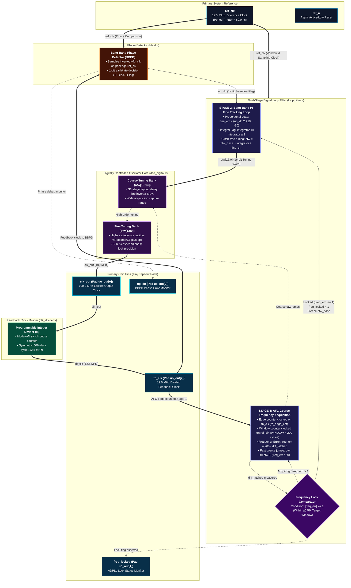

# NUAT Labs: All-Digital Phase-Locked Loop (ADPLL) Architecture, DV & Physical Design Guide

**Author**: NUAT Labs Engineering Team ([admin@nuatlabs.com](mailto:admin@nuatlabs.com))  
**Organization**: NUAT Labs ([github.com/nuatlabs](https://github.com/nuatlabs))  
**Target Node**: SCL 180nm CMOS (C2S eChip Hub, MeitY) / IHP 130nm (Tiny Tapeout)  
**License**: Apache-2.0 / MIT

---

## 1. High-Level Architectural Foundations (180 nm Scaled)

An All-Digital Phase-Locked Loop (ADPLL) is a closed-loop frequency synthesizer that generates a high-frequency output clock (`clk_out` at frequency `F_DCO`) phase- and frequency-locked to a low-frequency reference clock (`ref_clk` at frequency `F_REF`).



```text
========================================================================================================================
                                     NUAT-ADPLL ALL-DIGITAL SILICON ARCHITECTURE
========================================================================================================================

  ref_clk (12.5 MHz Reference)                                                       fb_clk (12.5 MHz Feedback)
     |           +-----------------------------------------------------------------------+          |
     +---------->|             DUAL-STAGE DIGITAL LOOP FILTER (loop_filter.v)            |<---------+ (AFC Edge Clock)
     |           |                                                                       |          |
     |           | [STAGE 1: AFC Coarse Frequency Acquisition]                           |          |
     |           | - Window counter on ref_clk (WINDOW = 200 cycles)                     |          |
     |           | - Edge counter clocked on fb_clk (fb_edge_cnt)                        |          |
     |           | - Frequency error: freq_err = 200 - diff_latched                      |          |
     |           | - Fast coarse jumps: otw <= otw + (freq_err * 50)                     |          |
     |           |                            |                                          |          |
     |           |                            v (Handoff: |freq_err| <= 1)               |          |
     |           |                            | (freq_locked = 1, freeze otw_base)       |          |
     |           |                            v                                          |          |
     |  up_dn -->| [STAGE 2: Bang-Bang PI Fine Tracking Loop]                            |          |
     | (1-bit)   | - Proportional Lead: fine_err = (up_dn ? +10 : -10)                   |          |
     |    ^      | - Integral Lag:     integrator <= integrator +/- 2                    |          |
     +----+----->| - Locked Tuning Word: otw = otw_base + integrator + fine_err          |          |
     |    |      | - Clocks PI accumulator on posedge ref_clk                            |          |
     |    |      +-----------------------------------------------------------------------+          |
     |    |                                  |                                                      |
     |    |                                  | otw[15:0] (16-bit Tuning Word)                       |
     |    |                                  v                                                      |
     |    |      +-----------------------------------------------------------------------+          |
     |    |      |                   DIGITAL DCO CORE (dco_digital.v)                    |          |
     |    |      |                                                                       |          |
     |    |      | - Coarse Tuning Bank: otw[15:13] (3-bit)                              |          |
     |    |      |   31-stage tapped delay line inverter MUX                             |          |
     |    |      |                                                                       |          |
     |    |      | - Fine Tuning Bank:   otw[12:0] (13-bit)                              |          |
     |    |      |   0.1 ps fine delay / capacitive varactor steps                       |          |
     |    |      +-----------------------------------------------------------------------+          |
     |    |                                  |                                                      |
     |    |                                  | clk_out (100 MHz Locked Clock)                       |
     |    |                                  +--------------------+------------------------> clk_out (100 MHz)
     |    |                                  |                    |                          [Pad uo_out[0]]
     |    |                                  |                    v                                 |
     |    |                                  |        +-----------------------+                     |
     |    |                                  |        | FEEDBACK CLOCK DIVIDER|                     |
     |    |                                  |        |    (clk_divider.v)    |                     |
     |    |                                  |        | - Integer divide: /8  |                     |
     |    |  up_dn (1-bit)                   |        | - 50% duty cycle      |                     |
     |    |                                  |        +-----------------------+                     |
     |    |                                  |                    |                                 |
     |    |                                  |                    | fb_clk (12.5 MHz)               |
     |  +-+------------------------+         |                    +---+--------------------> fb_clk (12.5 MHz)
     |  |   BBPD PHASE DETECTOR    |         |                    |   |                      [Pad uo_out[7]]
     |  |        (bbpd.v)          |         |                    |   |                             |
     |  |                          |         |                    |   +-----------------------------+
     +->| - Samples ~fb_clk on     |<--------+--------------------+
        |   posedge of ref_clk     |         fb_clk Feedback Bus
        +--------------------------+
```

### 1.1 Why Scale Down to 100 MHz for 180 nm SCL CMOS?
In deep submicron nodes (such as 28nm or 7nm), 1.0 GHz standard-cell clocks are routine. However, in **180 nm CMOS** (such as the SCL 180nm node from Semiconductor Laboratory, Chandigarh):
1. **Gate Delays**: A standard inverter Fan-Out-of-4 (FO4) delay is approximately `80 ps - 120 ps`.
2. **Sequential Overhead**: A standard-cell D-type Flip-Flop (DFF) has a setup time (`T_setup`) of `~0.3 ns - 0.5 ns` and a clock-to-Q delay (`T_clk2q`) of `~0.5 ns - 0.8 ns`. Total sequential overhead is `~1.0 ns` per register.
3. **Physical Infeasibility of 1.0 GHz**: At 1.0 GHz, the clock period is `1.0 ns (1000 ps)`. A 1.0 ns period cannot even cover a single flip-flop's setup + clock-to-Q time, leaving zero budget for combinational logic or clock skew.
4. **The 100 MHz Sweet Spot**:
   - `F_DCO = 100 MHz` corresponds to a clock period of `T_DCO = 10.0 ns (10,000 ps)`.
   - A 10.0 ns period provides ample timing margin (`~8.5 ns` for combinational adders, comparators, and wire delays), guaranteeing robust timing closure across PVT corners (Process, 1.8V Voltage, -40C to 125C Temperature).

### 1.2 Core Frequency & Timing Relationships
```
F_DCO = N * F_REF
T_DCO = T_REF / N
```

Scaled parameters for SCL 180nm:
- **Reference Clock**: `F_REF = 12.5 MHz` (Period `T_REF = 80.0 ns = 80,000 ps`)
- **Feedback Divide Ratio**: `N = 8`
- **Output DCO Clock**: `F_DCO = 8 * 12.5 MHz = 100 MHz` (Period `T_DCO = 10.0 ns = 10,000 ps`)
- **Center Code**: `OTW_CENTER = 32768` -> `10,000 ps (100 MHz)`
- **DCO Sensitivity (`K_DCO`)**: `GAIN_PS_PER_LSB = 0.2 ps/LSB` (scaled 10x for 100 MHz)

---

## 2. Deep Dive: Key Concepts & Theory

### 2.1 What is OTW (Oscillator Tuning Word)?
In a classic analog PLL, the oscillator (VCO) is controlled by a continuous analog voltage (`V_ctrl`). In this **All-Digital PLL (ADPLL)**, frequency is controlled by a 16-bit digital binary word:
```
otw[15:0] (Oscillator Tuning Word)
```

#### Transfer Function for 180 nm:
```
T_period(OTW) = 10,000 ps - ( (OTW - 32768) * 0.2 ps )
F_DCO(OTW)    = 1.0 / T_period(OTW)
```
- When `OTW = 32768`: `T_period = 10,000 ps` -> `F_DCO = 100.0 MHz`.
- When `OTW = 28000`: `T_period = 10,953.6 ps` -> `F_DCO = 91.3 MHz` (slower).
- When `OTW = 40000`: `T_period =  8,553.6 ps` -> `F_DCO = 116.9 MHz` (faster).

---

### 2.2 Why a Dual-Stage Loop Filter?
A Bang-Bang Phase Detector (BBPD) generates only **1 bit** of phase information per reference cycle: `1` (late) or `0` (early).

```
                      +---------------------------------------+
                      |               RESET                   |
                      +---------------------------------------+
                                          |
                                          v
                      +---------------------------------------+
                      |   STAGE 1: Coarse AFC Acquisition     |
                      |   - Counts fb_clk edges in window     |
                      |   - freq_err = WINDOW - delta_fb      |
                      |   - otw <= otw + (freq_err * KFREQ)   |
                      +---------------------------------------+
                                          |
                                          | (freq_err within +/-1 for
                                          |  LOCK_WINDOWS consecutive windows)
                                          v
                      +---------------------------------------+
                      |          MODE HANDOFF LATCH           |
                      |   - otw_base <= otw                   |
                      |   - freq_locked <= 1                  |
                      +---------------------------------------+
                                          |
                                          v
                      +---------------------------------------+
                      |   STAGE 2: Fine Bang-Bang PI Tracking |
                      |   - Integrator: int <= int +/- KI     |
                      |   - Proportional: prop = +/- KP       |
                      |   - OTW = otw_base + int + prop       |
                      +---------------------------------------+
```

1. **Stage 1 (Coarse AFC)**:
   - Measures frequency directly by counting `fb_clk` edges over a 200-cycle reference window.
   - Completely immune to phase-aliasing and the 50/50 duty cycle cancellation trap.
   - Takes large correction steps (`otw <= otw + freq_err * KFREQ`) to bring the oscillator within 0.5% of 100 MHz in 2 to 3 measurement windows (`~32 to 48 microseconds`).
2. **Handoff**:
   - `otw_base <= otw` captures the coarse baseline code (e.g. `32650`) on the exact cycle `freq_locked` rises.
3. **Stage 2 (Fine PI Tracking)**:
   - The fine loop takes over using the BBPD's 1-bit `up_dn` decision.
   - The integrator (`KI`) cancels steady-state phase error; the proportional path (`KP`) provides lead compensation and loop damping.

---

### 2.3 Why Route `fb_clk` to the Loop Filter?
Inside [loop_filter.v](file:///c:/Users/S%20Sreedhar%20Goud/Downloads/pll%20files/loop_filter.v), an 8-bit edge counter runs on `posedge fb_clk`:
```verilog
always @(posedge fb_clk or negedge rst_n) begin
    if (!rst_n)
        fb_edge_cnt <= 8'd0;
    else
        fb_edge_cnt <= fb_edge_cnt + 8'd1;
end
```
Every `WINDOW` (200) `ref_clk` cycles:
```
diff_latched = (fb_edge_cnt_now - fb_edge_cnt_prev) mod 256
freq_err     = WINDOW - diff_latched
```
- If `diff_latched < 200`: DCO is slow -> `freq_err > 0` -> OTW increases.
- If `diff_latched > 200`: DCO is fast -> `freq_err < 0` -> OTW decreases.
Without `fb_clk` entering the loop filter, Stage 1 frequency measurement would be impossible.

---

## 3. Module Inventory & 180 nm Specifications

| Module File | Component | Key Ports | 180 nm Scaled Parameters |
|:---|:---|:---|:---|
| `adpll_digital_top.v` | Top Level System | `ref_clk`, `rst_n`, `clk_out`, `fb_clk`, `otw`, `freq_locked` | `N=8`, `KP=10`, `KI=2`, `USE_INTERNAL_DCO=1` |
| `bbpd.v` | Bang-Bang Phase Detector | `ref_clk`, `rst_n`, `fb_clk`, `up_dn` | Maps to standard-cell DFF |
| `loop_filter.v` | Dual-Stage Loop Filter | `ref_clk`, `rst_n`, `up_dn`, `fb_clk`, `otw`, `freq_locked` | `WINDOW=200`, `KFREQ=50`, `KP=50`, `KI=25` |
| `dco_digital.v` | Synthesizable DCO | `rst_n`, `otw`, `clk_out` | `T_CENTER_PS=10000.0`, `GAIN_PS_PER_LSB=0.2` |
| `dco_model.v` | Behavioral DCO Model | `otw`, `clk_out` | `T_CENTER_PS=10000.0`, `GAIN_PS_PER_LSB=0.2` |
| `clk_divider.v` | Programmable /8 Divider | `clk_in`, `rst_n`, `clk_out` | `N=8`, `CNT_WIDTH=8` (50% duty cycle) |

---

## 4. Design Verification (DV) Flow (180 nm Verification)

### Step 4.1: Compile the Testbench and RTL
Execute from your terminal in the pll directory:
```powershell
iverilog -g2012 -o sim_180nm.out tb_adpll_digital.v adpll_digital_top.v bbpd.v clk_divider.v dco_digital.v loop_filter.v
```

### Step 4.2: Run the Simulation Runtime
```powershell
vvp sim_180nm.out
```

**Verified Simulation Output**:
```text
VCD info: dumpfile adpll_180nm.vcd opened for output.
[160290318600 ps] 180nm ADPLL LOCKED! Measured period = 10073.600 ps (target 10000.000 ps), OTW=32400
TEST PASSED: 180nm ADPLL locked successfully! Final OTW=32774, period=9998.800 ps
Reference Freq = 12.5 MHz (Period = 80000.0 ps), Target DCO Freq = 100 MHz (Period = 10000.0 ps)
```

### Step 4.3: Inspect Waveforms with GTKWave
```powershell
gtkwave adpll_180nm.vcd
```
Signals to verify:
- `tb_adpll_digital.ref_clk`: 12.5 MHz square wave (Period = 80.0 ns).
- `tb_adpll_digital.dut.clk_out`: 100 MHz locked clock (Period = 10.0 ns).
- `tb_adpll_digital.dut.otw`: Steps from 28000 up to ~32774.
- `tb_adpll_digital.dut.freq_locked`: Rises to 1 when coarse lock is verified.

---

## 5. Physical Design (PD) Flow for SCL 180nm (C2S eChip Hub)

This flow targets the **SCL 180nm CMOS standard-cell library (`tsl18fs120_scl`)** provided via the C2S eChip Hub program (MeitY).

```
   [ Verilog RTL ] + [ adpll.sdc ] + [ SCL 180nm Standard Cell Liberty (.lib) ]
                           |
                           v
                 +-------------------+
                 | 1. RTL Synthesis  |  (Yosys / Cadence Genus / Synopsys DC)
                 +-------------------+
                           |
                           v
                 +-------------------+
                 | 2. Floorplanning  |  (OpenROAD / Cadence Innovus / Synopsys ICC2)
                 +-------------------+  Core Utilization: 40-50%, VDD=1.8V, VSS=0V
                           |
                           v
                 +-------------------+
                 | 3. Cell Placement |  Global & detailed standard cell placement
                 +-------------------+
                           |
                           v
                 +-------------------+
                 | 4. Clock Tree(CTS)|  TritonCTS: Skew < 50 ps on 100 MHz DCO clock
                 +-------------------+
                           |
                           v
                 +-------------------+
                 | 5. Routing        |  Multi-layer metal routing (Metal1 to Metal4/5)
                 +-------------------+
                           |
                           v
                 +-------------------+
                 | 6. Signoff STA    |  OpenSTA: Setup Slack > 4.0 ns, Hold Slack > 0.2 ns
                 +-------------------+
                           |
                           v
                 +-------------------+
                 | 7. DRC / LVS / GDS|  Magic / KLayout (DRC), Netgen (LVS), GDSII export
                 +-------------------+
```

---

### Step 5.1: Logic Synthesis (Yosys)
Run Yosys using the provided [synth.ys](file:///c:/Users/S%20Sreedhar%20Goud/Downloads/pll%20files/synth.ys) script:
```bash
yosys synth.ys
```
- **Inputs**: `adpll_digital_top.v`, `bbpd.v`, `clk_divider.v`, `loop_filter.v`, `dco_digital.v`.
- **Output**: `synth_output.v` (gate-level netlist).

---

### Step 5.2: Static Timing Constraints (SDC)
The timing constraints file [adpll.sdc](file:///c:/Users/S%20Sreedhar%20Goud/Downloads/pll%20files/adpll.sdc) specifies the scaled 180nm clock domains:
```tcl
# 12.5 MHz Reference Clock (Period = 80.0 ns)
create_clock -name ref_clk -period 80.0 [get_ports ref_clk]
set_clock_uncertainty 0.20 [get_clocks ref_clk]
set_clock_transition  0.30 [get_clocks ref_clk]

# 100 MHz DCO Clock (Period = 10.0 ns)
create_clock -name dco_clk -period 10.0 [get_ports clk_out]
set_clock_uncertainty 0.10 [get_clocks dco_clk]
set_clock_transition  0.15 [get_clocks dco_clk]

# Divided 12.5 MHz Feedback Clock
create_generated_clock -name fb_clk \
    -source [get_ports clk_out] \
    -divide_by 8 \
    [get_pins u_div/clk_out]

# Asynchronous Clock Domains
set_clock_groups -asynchronous \
    -group [get_clocks ref_clk] \
    -group [get_clocks {dco_clk fb_clk}]
```

---

### Step 5.3: Floorplanning & Power Distribution (SCL 180nm)
In OpenROAD or Cadence Innovus:
- **Die Size**: For this ~800-gate digital core in SCL 180nm, a die area of `120 um x 120 um` to `150 um x 150 um` is ideal.
- **Core Utilization**: Set to `40% - 50%` to ensure easy routing and congestion-free clock tree buffer insertion.
- **Power Grid (PDN)**:
  - Standard SCL 180nm voltage: **VDD = 1.8V**, **VSS = 0.0V**.
  - Power rings and straps on Metal3 and Metal4 to ensure IR drop is less than 2% (< 36 mV).

---

### Step 5.4: Placement & Clock Tree Synthesis (CTS)
- **Cell Placement**: Keep the feedback divider (`u_div`) and phase detector (`u_bbpd`) close to the DCO output to minimize parasitic interconnect delay on the 100 MHz net.
- **Clock Tree Synthesis (CTS)**:
  - Tool: `TritonCTS` (or Innovus CCOpt).
  - Target skew: `< 50 ps` across all flip-flops in the 100 MHz domain.
  - SCL 180nm clock buffers (`CLKBUF_X4`, `CLKBUF_X8`) are inserted to maintain clock transitions `< 0.2 ns`.

---

### Step 5.5: Routing & Shielding
- Metal stack: Standard SCL 180nm provides 4 or 5 metal layers (M1 - M4/M5).
- Route signal nets on M1 - M3.
- **Clock Shielding**: The 100 MHz `clk_out` line should be shielded with adjacent VSS lines (coplanar shielding) to prevent inductive/capacitive crosstalk into sensitive digital filter nets.

---

### Step 5.6: Timing Closure & Signoff
1. **Static Timing Analysis (OpenSTA)**:
   - Check Worst Negative Slack (`WNS >= 0`).
   - At 100 MHz (10.0 ns period), the critical path in `loop_filter.v` is typically `~2.5 ns`, leaving `~7.5 ns of positive slack`!
2. **DRC / LVS Signoff**:
   - Magic / KLayout: Verify zero DRC violations against the SCL 180nm DRC deck.
   - Netgen: Compare extracted SPICE netlist against `synth_output.v` (LVS Clean).
3. **GDSII Export**: Generate `adpll_digital_top.gds` for submission through the C2S eChip Hub portal.
