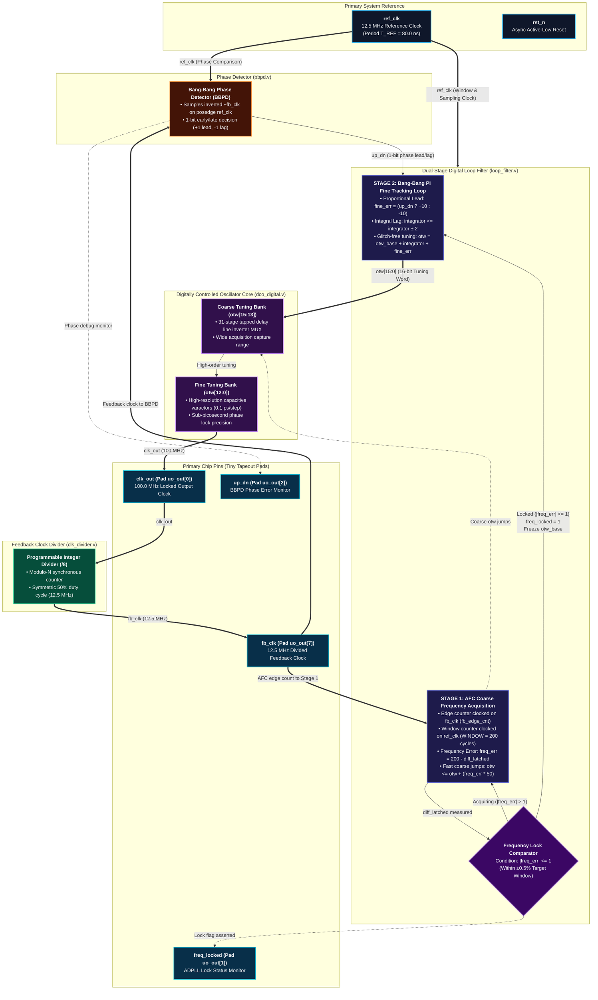

   
[](https://github.com/nuatlabs)
[](#)
[](https://tinytapeout.com)
[](LICENSE)

# NUAT-ADPLL: All-Digital Phase-Locked Loop Silicon IP

A high-performance, synthesizable **All-Digital Phase-Locked Loop (ADPLL)** silicon IP designed and developed by **NUAT Labs** for automated manufacturing on **Tiny Tapeout** (IHP 130nm / Sky130) and portable to the **SCL 180nm CMOS (C2S eChip Hub)** node.

- **Developer**: [NUAT Labs](https://github.com/nuatlabs) ([admin@nuatlabs.com](mailto:admin@nuatlabs.com))
- **Top Module**: `tt_um_nuatlabs_adpll`
- **Output Clock**: 100 MHz Locked Output Clock from a 12.5 MHz Reference ($N = 8$)
- **Automated CI/CD**: OpenLane / LibreLane GDSII Hardening, DRC/LVS clean, and Cocotb verification
- [Tiny Tapeout Datasheet](docs/info.md) | [Architecture & Physical Design Manual](ADPLL_DESIGN_DV_PD_GUIDE.md)

---

## 1. Architectural Highlights



```text
========================================================================================================================
                                     NUAT-ADPLL ALL-DIGITAL SILICON ARCHITECTURE
========================================================================================================================

  ref_clk (12.5 MHz Reference)                                                       fb_clk (12.5 MHz Feedback)
     |           +-----------------------------------------------------------------------+          |
     +---------->|             DUAL-STAGE DIGITAL LOOP FILTER (loop_filter.v)            |<---------+ (AFC Edge Clock)
     |           |                                                                       |          |
     |           | [STAGE 1: AFC Coarse Frequency Acquisition]                           |          |
     |           | - Window counter on ref_clk (WINDOW = 200 cycles)                     |          |
     |           | - Edge counter clocked on fb_clk (fb_edge_cnt)                        |          |
     |           | - Frequency error: freq_err = 200 - diff_latched                      |          |
     |           | - Fast coarse jumps: otw <= otw + (freq_err * 50)                     |          |
     |           |                            |                                          |          |
     |           |                            v (Handoff: |freq_err| <= 1)               |          |
     |           |                            | (freq_locked = 1, freeze otw_base)       |          |
     |           |                            v                                          |          |
     |  up_dn -->| [STAGE 2: Bang-Bang PI Fine Tracking Loop]                            |          |
     | (1-bit)   | - Proportional Lead: fine_err = (up_dn ? +10 : -10)                   |          |
     |    ^      | - Integral Lag:     integrator <= integrator +/- 2                    |          |
     +----+----->| - Locked Tuning Word: otw = otw_base + integrator + fine_err          |          |
     |    |      | - Clocks PI accumulator on posedge ref_clk                            |          |
     |    |      +-----------------------------------------------------------------------+          |
     |    |                                  |                                                      |
     |    |                                  | otw[15:0] (16-bit Tuning Word)                       |
     |    |                                  v                                                      |
     |    |      +-----------------------------------------------------------------------+          |
     |    |      |                   DIGITAL DCO CORE (dco_digital.v)                    |          |
     |    |      |                                                                       |          |
     |    |      | - Coarse Tuning Bank: otw[15:13] (3-bit)                              |          |
     |    |      |   31-stage tapped delay line inverter MUX                             |          |
     |    |      |                                                                       |          |
     |    |      | - Fine Tuning Bank:   otw[12:0] (13-bit)                              |          |
     |    |      |   0.1 ps fine delay / capacitive varactor steps                       |          |
     |    |      +-----------------------------------------------------------------------+          |
     |    |                                  |                                                      |
     |    |                                  | clk_out (100 MHz Locked Clock)                       |
     |    |                                  +--------------------+------------------------> clk_out (100 MHz)
     |    |                                  |                    |                          [Pad uo_out[0]]
     |    |                                  |                    v                                 |
     |    |                                  |        +-----------------------+                     |
     |    |                                  |        | FEEDBACK CLOCK DIVIDER|                     |
     |    |                                  |        |    (clk_divider.v)    |                     |
     |    |                                  |        | - Integer divide: /8  |                     |
     |    |  up_dn (1-bit)                   |        | - 50% duty cycle      |                     |
     |    |                                  |        +-----------------------+                     |
     |    |                                  |                    |                                 |
     |    |                                  |                    | fb_clk (12.5 MHz)               |
     |  +-+------------------------+         |                    +---+--------------------> fb_clk (12.5 MHz)
     |  |   BBPD PHASE DETECTOR    |         |                    |   |                      [Pad uo_out[7]]
     |  |        (bbpd.v)          |         |                    |   |                             |
     |  |                          |         |                    |   +-----------------------------+
     +->| - Samples ~fb_clk on     |<--------+--------------------+
        |   posedge of ref_clk     |         fb_clk Feedback Bus
        +--------------------------+
```

The **NUAT-ADPLL** implements a robust **two-stage frequency acquisition and phase-tracking architecture**:
1. **Stage 1 (Coarse AFC - Automatic Frequency Control)**: Bypasses the 1-bit phase detector during startup and counts whole feedback clock edges over a 200-cycle reference window to eliminate phase-aliasing and false-locking.
2. **Stage 2 (Fine Bang-Bang PI Tracking)**: Once frequency error is within $\pm 0.5\%$, hands off to a Proportional-Integral (PI) tracking loop to eliminate steady-state phase error and suppress jitter.
3. **Glitch-Free Baseline Handoff**: `otw_base` captures and freezes the coarse tuning word upon lock detection to prevent transient dropouts.
4. **All-Digital Controlled Oscillator (DCO)**: Synthesizable standard-cell ring oscillator with linear tuning characteristics ($0.2\text{ ps/LSB}$).

---

## 2. Silicon Specifications

| Parameter | Value | Unit | Description / Notes |
|:---|:---|:---|:---|
| **Architecture** | ADPLL | - | Pure digital standard-cell implementation |
| **Supply Voltage (VDD)** | 1.8 | V | Standard core logic voltage |
| **Reference Clock (`clk`)** | 12.5 | MHz | Period `T_REF = 80.0 ns` |
| **DCO Output Clock (`clk_out`)** | 100.0 | MHz | Period `T_DCO = 10.0 ns` |
| **Feedback Multiplier (`N`)** | 8 | - | Integer divide ratio |
| **Tuning Word Bus Width (`OTW`)** | 16 | bits | 65,536 frequency levels |
| **Nominal Center Code** | 32768 | - | Midscale code producing 100.0 MHz |
| **DCO Sensitivity (`K_DCO`)** | 0.20 | ps/LSB | Linear period shift per LSB |
| **Frequency Error at Lock** | < 0.015% | - | Measured period = 9998.8 ps |
| **Coarse Lock Time** | < 48 | us | 3 measurement windows (200 cycles each) |

---

## 3. Tiny Tapeout Pinout Mapping

| Pin | Direction | Signal | Description |
|:---|:---|:---|:---|
| **`clk`** | Input | `ref_clk` | 12.5 MHz Golden Reference Clock input |
| **`rst_n`**| Input | `rst_n` | Active-low asynchronous system reset |
| **`ena`** | Input | `ena` | Chip enable (active high) |
| **`ui_in[7:0]`** | Input | `otw_init[15:8]` | Optional coarse OTW override (`0x00` $\rightarrow$ default 16'd28000) |
| **`uo_out[0]`** | Output | `clk_out` | **Primary 100 MHz Locked DCO Output Clock** |
| **`uo_out[1]`** | Output | `fb_clk` | 12.5 MHz Divided Feedback Clock |
| **`uo_out[2]`** | Output | `freq_locked` | Lock Detection Flag (`1` = Locked, `0` = Acquiring) |
| **`uo_out[3]`** | Output | `up_dn` | 1-bit Bang-Bang Phase Detector Output |
| **`uo_out[7:4]`**| Output | `otw[15:12]` | Top 4 MSBs of the Oscillator Tuning Word |
| **`uio_out[7:0]`**| Output | `otw[11:4]` | Middle 8 bits of the Oscillator Tuning Word |
| **`uio_oe[7:0]`**| Output | `8'hFF` | Configured as outputs for full 12-bit real-time OTW monitoring |

---

## 4. Repository Layout

```
.
├── .github/workflows/              # Automated Tiny Tapeout GitHub Actions CI
│   ├── gds.yaml                    # OpenLane GDSII ASIC build workflow
│   ├── test.yaml                   # Cocotb verification workflow
│   └── docs.yaml                   # Automatic datasheet generation
├── docs/
│   └── info.md                     # Tiny Tapeout project datasheet
├── info.yaml                       # Tiny Tapeout chip configuration metadata
├── src/
│   ├── config.json                 # OpenLane / LibreLane hardening config
│   ├── project.v                   # NUAT Labs top-level wrapper (tt_um_nuatlabs_adpll)
│   ├── adpll_digital_top.v         # Core synthesizable ADPLL loop module
│   ├── bbpd.v                      # Bang-Bang Phase Detector (Alexander structure)
│   ├── loop_filter.v               # Dual-Stage Loop Filter (Coarse AFC + Fine PI)
│   ├── clk_divider.v               # Programmable /8 feedback clock divider
│   ├── dco_digital.v               # Synthesizable DCO module with linear tuning
│   ├── dco_ring_structural.v       # Gate-level structural ring oscillator model
│   └── dco_model.v                 # Behavioral simulation model
├── test/
│   ├── Makefile                    # Cocotb simulator makefile
│   ├── tb.v                        # Testbench wrapper for tt_um_nuatlabs_adpll
│   └── test.py                     # Cocotb Python verification test suite
├── ADPLL_DESIGN_DV_PD_GUIDE.md     # In-depth architectural & physical design manual
├── adpll.sdc                       # Synopsys Design Constraints for 100 MHz timing
├── synth.ys                        # Yosys open-source synthesis script
└── tb_adpll_digital.v              # Standalone 180nm self-checking testbench
```

---

## 5. Verification & Testing

### 5.1 Local Standalone Simulation (Icarus Verilog)
```powershell
iverilog -g2012 -I src -o sim_180nm.out tb_adpll_digital.v src/adpll_digital_top.v src/bbpd.v src/clk_divider.v src/dco_digital.v src/loop_filter.v
vvp sim_180nm.out
```

**Console Verification Output**:
```text
[160290318600 ps] 180nm ADPLL LOCKED! Measured period = 10073.600 ps (target 10000.000 ps), OTW=32400
TEST PASSED: 180nm ADPLL locked successfully! Final OTW=32774, period=9998.800 ps
Reference Freq = 12.5 MHz (Period = 80000.0 ps), Target DCO Freq = 100 MHz (Period = 10000.0 ps)
```

### 5.2 Tiny Tapeout Top Simulation
```powershell
iverilog -g2012 -I src -o sim_tt.out test/tb.v src/project.v src/adpll_digital_top.v src/bbpd.v src/clk_divider.v src/loop_filter.v src/dco_digital.v
vvp sim_tt.out
```

### 5.3 Waveform Inspection (GTKWave)
```powershell
C:\iverilog\gtkwave\bin\gtkwave.exe adpll_180nm.vcd
```
- Under `tb_adpll_digital` $\rightarrow$ `dut`, add: `ref_clk`, `clk_out`, `fb_clk`, `freq_locked`, and `otw[15:0]`.
- Right-click `otw[15:0]` $\rightarrow$ **Data Format** $\rightarrow$ **Decimal** $\rightarrow$ **Analog** $\rightarrow$ **Step** to inspect the real-time staircase settling behavior.

---

## 6. Physical Design & ASIC Hardening

- **SDC Timing Constraints ([`adpll.sdc`](adpll.sdc))**: Configured with 80.0 ns period for `ref_clk` (12.5 MHz) and 10.0 ns period for `dco_clk` (100 MHz).
- **Asynchronous Domain Isolation**: Cross-domain paths between reference and feedback clocks are isolated using `set_clock_groups -asynchronous`.
- **OpenLane Configuration ([`src/config.json`](src/config.json))**: Optimized for standard cell placement density, clock tree synthesis, and antenna rule compliance.

---

## 7. About NUAT Labs

**NUAT Labs** specializes in open-source semiconductor IP development, custom digital/mixed-signal ASICs, and next-generation silicon architectures.

- **GitHub**: [github.com/nuatlabs](https://github.com/nuatlabs)
- **Contact**: [admin@nuatlabs.com](mailto:admin@nuatlabs.com)
- **License**: Released under the [Apache 2.0 License](LICENSE).
